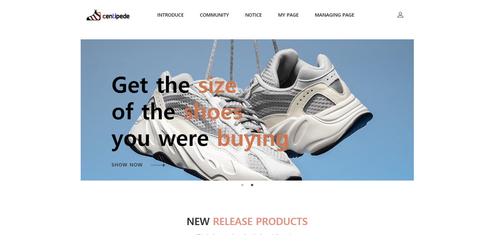

# Centipede
> 신발 관련 커뮤니티 게시판 centipede를 만들었습니다.




## 제작 동기

> 지네가 되어서 많은 신발을 신고싶다는 유머에서 착안했습니다.  
> Someone said, I want to be a centipede and wear more shoes.  

주된 기능은 다음과 같습니다.
 1. 다양한 브랜드의 한정판 신발의 발매일을 한 페이지에서 확인할수 있습니다.
 2. 새로운 신발을 구매하고자 할 때 상대적인 신발 사이즈에 대한 팁을 공유하는 페이지를 만들고자 했습니다.  


## 개발환경

 개발환경은 아래와 같습니다.  
 
```sh
 Front-end : HTML, CSS, Java Script, jQuery 3, BootStrap 3   
 Back-end : EgovFrameWork, Java, Jdk 1.8, MariaDB 2 , Mybatis 3, Maven, Tomcat 7
```  

## 정보

Email - vlwys1234@naver.com

 
